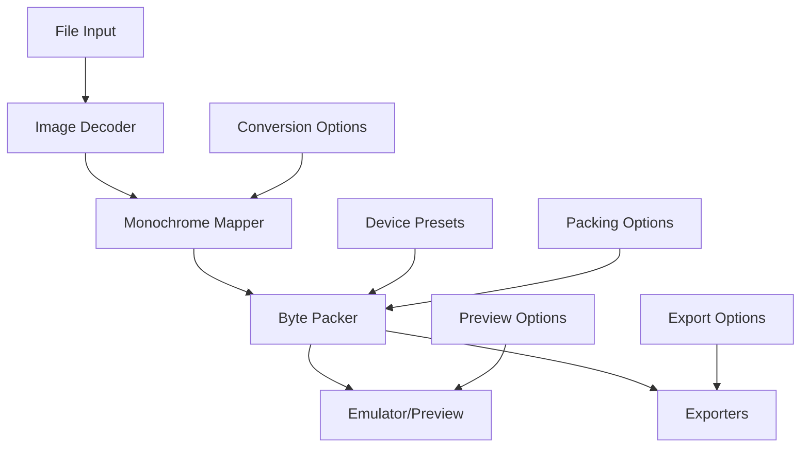
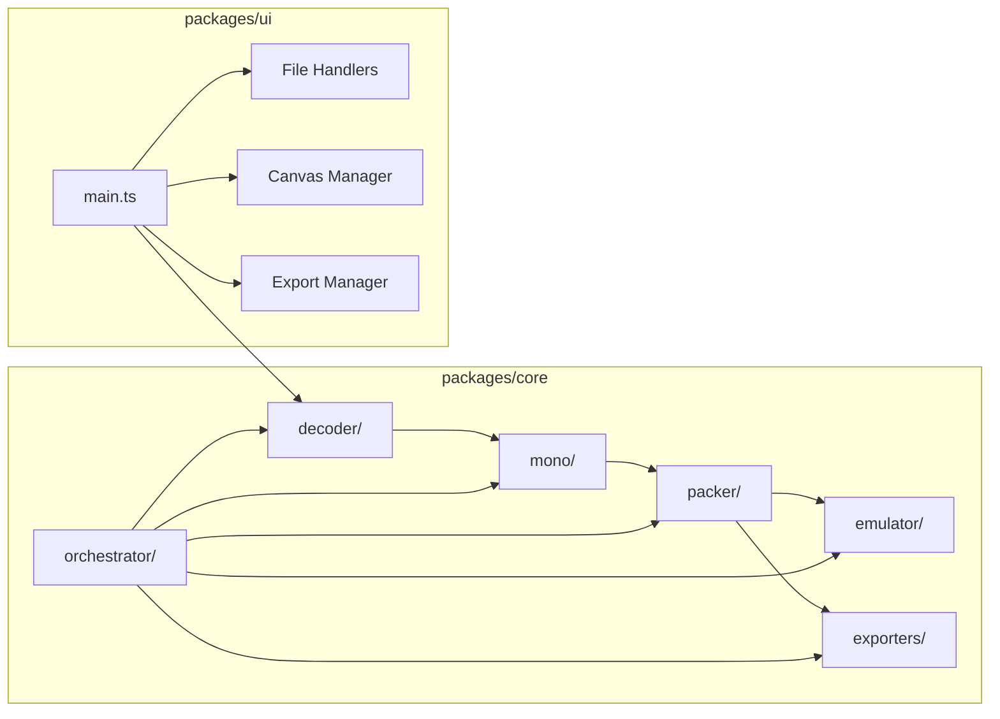
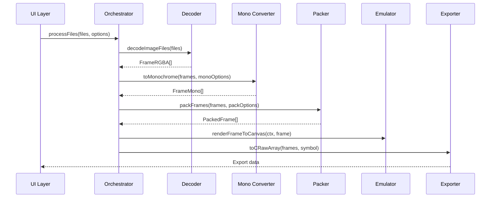
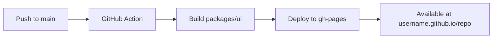

# Design Document

## Overview

The Tiny Screen Studios Web MVP is architected as a monorepo with two main packages: a headless core library and a minimal UI wrapper. The system follows a pipeline architecture where data flows through distinct processing stages: File Input → Image Decoding → Monochrome Conversion → Device-Specific Packing → Preview/Export.

The core design principles are:

- **Separation of Concerns**: Pure logic in core, minimal DOM interaction in UI
- **Type Safety**: Strict TypeScript throughout with comprehensive type definitions
- **Performance**: Optimized for real-time preview and batch processing
- **Extensibility**: Plugin-like architecture for adding new device presets
- **Browser-First**: No backend dependencies, works entirely client-side

## Architecture

### High-Level System Architecture



### Package Architecture



### Data Flow Architecture

The system processes data through a series of transformations:

1. **Raw Files** → **FrameRGBA[]** (decoder)
2. **FrameRGBA[]** → **FrameMono[]** (mono converter)
3. **FrameMono[]** → **PackedFrame[]** (packer)
4. **PackedFrame[]** → **Canvas Rendering** (emulator)
5. **PackedFrame[]** → **Export Formats** (exporters)

## Components and Interfaces

### Core Type Definitions

```typescript
// Base types
export type Dimensions = { width: number; height: number };

// Frame representations at different stages
export type FrameRGBA = {
  pixels: Uint8ClampedArray; // RGBA pixel data
  dims: Dimensions;
  delayMs?: number; // For animations
};

export type FrameMono = {
  bits: Uint8Array; // 1-bit logical grid (1 bit per pixel)
  dims: Dimensions;
};

export type PackedFrame = {
  bytes: Uint8Array; // Device-specific byte layout
  dims: Dimensions;
  preset: DevicePreset;
  delayMs?: number;
};

// Device and configuration types
export type DevicePreset =
  | 'SSD1306_128x32'
  | 'SSD1306_128x64'
  | 'SH1106_132x64';

export type PackingOptions = {
  preset: DevicePreset;
  invert?: boolean;
  bitOrder?: 'lsb-top' | 'msb-top';
  pageOrder?: 'top-down' | 'bottom-up';
  columnOrder?: 'left-right' | 'right-left';
};

export type MonochromeOptions = {
  threshold?: number; // 0-255, default 128
  dithering?: 'none' | 'bayer4';
  invert?: boolean;
};
```

### Decoder Module

**Responsibility**: Convert uploaded files into standardized RGBA frame data

```typescript
export interface ImageDecoder {
  decodeImageFiles(files: File[]): Promise<FrameRGBA[]>;
  validateDimensions(
    frames: FrameRGBA[],
    expected: Dimensions
  ): ValidationResult;
  orderFramesByFilename(frames: FrameRGBA[], files: File[]): FrameRGBA[];
}
```

**Key Design Decisions**:

- Uses `createImageBitmap()` for optimal performance
- Enforces numeric ordering of PNG sequences
- Validates dimensions against selected device preset
- Handles both single images and sequences

### Monochrome Converter Module

**Responsibility**: Convert RGBA frames to 1-bit monochrome

```typescript
export interface MonochromeConverter {
  toMonochrome(frames: FrameRGBA[], options?: MonochromeOptions): FrameMono[];
  calculateLuminance(r: number, g: number, b: number): number;
  applyThreshold(luminance: number, threshold: number): boolean;
  applyBayerDithering(frame: FrameRGBA, threshold: number): FrameMono;
}
```

**Key Design Decisions**:

- Uses standard luminance formula: `0.299*R + 0.587*G + 0.114*B`
- Supports configurable threshold (default 128)
- Implements Bayer 4x4 ordered dithering matrix
- Processes pixels in-place for memory efficiency

### Byte Packer Module

**Responsibility**: Convert monochrome frames to device-specific byte layouts

```typescript
export interface BytePacker {
  packFrames(frames: FrameMono[], options: PackingOptions): PackedFrame[];
  getPresetConfig(preset: DevicePreset): PresetConfig;
  packSSD1306(frame: FrameMono, config: PresetConfig): Uint8Array;
  packSH1106(frame: FrameMono, config: PresetConfig): Uint8Array;
}

type PresetConfig = {
  width: number;
  height: number;
  pageHeight: number; // Always 8 for current displays
  bitOrder: 'lsb-top' | 'msb-top';
  pageOrder: 'top-down' | 'bottom-up';
  columnOrder: 'left-right' | 'right-left';
};
```

**Key Design Decisions**:

- SSD1306: Pages are 8-pixel vertical strips, bit 0 = top pixel
- SH1106: Similar to SSD1306 but 132 columns wide (128 visible)
- Configurable bit/page/column ordering for different firmware needs
- Preallocated byte arrays for performance

### Emulator Module

**Responsibility**: Render packed frames pixel-exactly on HTML5 Canvas

```typescript
export interface DisplayEmulator {
  renderFrameToCanvas(
    ctx: CanvasRenderingContext2D,
    frame: PackedFrame,
    options?: RenderOptions
  ): void;

  playFramesOnCanvas(
    ctx: CanvasRenderingContext2D,
    frames: PackedFrame[],
    options?: AnimationOptions
  ): AnimationController;
}

type RenderOptions = {
  scale?: number; // Pixel scaling factor
  showGrid?: boolean; // Overlay pixel grid
  invert?: boolean; // Invert display colors
};

type AnimationController = {
  stop(): void;
  goTo(frameIndex: number): void;
  setFPS(fps: number): void;
};
```

**Key Design Decisions**:

- Disables canvas image smoothing for pixel-perfect rendering
- Supports real-time parameter changes
- Uses `requestAnimationFrame` for smooth animations
- Handles SH1106 viewport offset (132→128 pixel window)

### Exporters Module

**Responsibility**: Generate various output formats from packed frames

```typescript
export interface DataExporter {
  toCRawArray(
    frames: PackedFrame[],
    symbolName: string,
    options?: CExportOptions
  ): string;

  makeByteFiles(
    frames: PackedFrame[],
    basename: string
  ): { name: string; data: Uint8Array }[];

  toPreviewGIF(frames: PackedFrame[], options?: GIFOptions): Uint8Array;
}

type CExportOptions = {
  perFrame?: boolean; // Separate arrays per frame
  bytesPerRow?: number; // Formatting for readability
  includeMetadata?: boolean; // Add dimension/timing comments
};
```

**Key Design Decisions**:

- C arrays use `const uint8_t` with configurable formatting
- Binary exports support both per-frame and concatenated modes
- Optional GIF export for preview/sharing (v0.1 feature)
- Includes metadata comments in generated code

## Data Models

### Frame Processing Pipeline



### Memory Management Strategy

- **Typed Arrays**: Use `Uint8Array` and `Uint8ClampedArray` for all pixel data
- **Preallocated Buffers**: Reuse buffers for repeated operations
- **Streaming Processing**: Process frames individually for large sequences
- **Web Workers**: Offload heavy processing to prevent UI blocking

### Device Preset Configurations

```typescript
const DEVICE_PRESETS: Record<DevicePreset, PresetConfig> = {
  SSD1306_128x32: {
    width: 128,
    height: 32,
    pageHeight: 8,
    bitOrder: 'lsb-top',
    pageOrder: 'top-down',
    columnOrder: 'left-right',
  },
  SSD1306_128x64: {
    width: 128,
    height: 64,
    pageHeight: 8,
    bitOrder: 'lsb-top',
    pageOrder: 'top-down',
    columnOrder: 'left-right',
  },
  SH1106_132x64: {
    width: 132, // Physical width
    height: 64,
    pageHeight: 8,
    bitOrder: 'lsb-top',
    pageOrder: 'top-down',
    columnOrder: 'left-right',
    viewportOffset: 2, // Show columns 2-129
  },
};
```

## Error Handling

### Validation Strategy

```typescript
export type ValidationResult = {
  isValid: boolean;
  errors: ValidationError[];
  warnings: ValidationWarning[];
};

export type ValidationError = {
  type:
    | 'dimension_mismatch'
    | 'corrupt_file'
    | 'unsupported_format'
    | 'byte_count_error';
  message: string;
  context?: any;
};
```

### Error Categories and Handling

1. **File Input Errors**
   - Unsupported file formats → Clear format requirements
   - Corrupt/unreadable files → Graceful skip with warning
   - Missing files in sequence → Gap detection and warning

2. **Dimension Validation Errors**
   - Wrong dimensions → "Expected 128×32, got 256×64"
   - Inconsistent dimensions across frames → Frame-by-frame validation

3. **Processing Errors**
   - Memory allocation failures → Fallback to smaller batch sizes
   - Canvas rendering errors → Fallback rendering mode

4. **Export Errors**
   - File system access denied → Alternative download methods
   - Invalid export parameters → Parameter validation with suggestions

### Error Recovery Mechanisms

- **Graceful Degradation**: Continue processing valid frames when some fail
- **Retry Logic**: Automatic retry for transient failures
- **User Feedback**: Clear, actionable error messages with suggested fixes
- **Fallback Modes**: Alternative processing paths when optimal methods fail

## Testing Strategy

### Unit Testing Approach

```typescript
// Example test structure
describe('BytePacker', () => {
  describe('SSD1306_128x32', () => {
    it('should pack single pixel at (0,0) to first byte bit 0', () => {
      const frame = createTestFrame(128, 32, [(0, 0)]);
      const packed = packer.packFrames([frame], { preset: 'SSD1306_128x32' });
      expect(packed[0].bytes[0]).toBe(0x01); // LSB set
    });

    it('should pack top page fill correctly', () => {
      const frame = createTestFrame(128, 32, topPagePixels);
      const packed = packer.packFrames([frame], { preset: 'SSD1306_128x32' });
      expect(packed[0].bytes.slice(0, 128)).toEqual(
        new Uint8Array(128).fill(0xff)
      );
    });
  });
});
```

### Golden Fixture Testing

- **Reference Images**: Known PNG inputs with expected byte outputs
- **Device Verification**: Outputs tested on actual hardware
- **Cross-Platform**: Consistent results across different browsers
- **Performance Benchmarks**: Regression testing for processing speed

### Integration Testing

- **End-to-End Workflows**: File upload → processing → export
- **UI Interaction**: Canvas rendering, animation playback
- **Error Scenarios**: Invalid inputs, edge cases, resource limits

### Performance Testing

- **Large File Handling**: 100+ frame sequences
- **Memory Usage**: Monitor for leaks during batch processing
- **Rendering Performance**: 60fps animation playback
- **Web Worker Efficiency**: Background processing benchmarks

## Deployment Architecture

### Build System

```yaml
# pnpm-workspace.yaml
packages:
  - 'packages/*'

# Build pipeline
- Core: TypeScript → ESM/UMD bundles
- UI: Vite → Static assets for GitHub Pages
- Tests: Vitest with coverage reporting
- Linting: ESLint + Prettier + EditorConfig
```

### GitHub Pages Deployment



### Performance Optimizations

- **Code Splitting**: Lazy load heavy modules (dithering, GIF export)
- **Asset Optimization**: Compressed sample images, minimal CSS
- **Caching Strategy**: Aggressive caching for static assets
- **Bundle Analysis**: Monitor bundle size and dependencies

This design provides a solid foundation for implementing the Tiny Screen Studios MVP with clear separation of concerns, comprehensive error handling, and a focus on performance and user experience.
